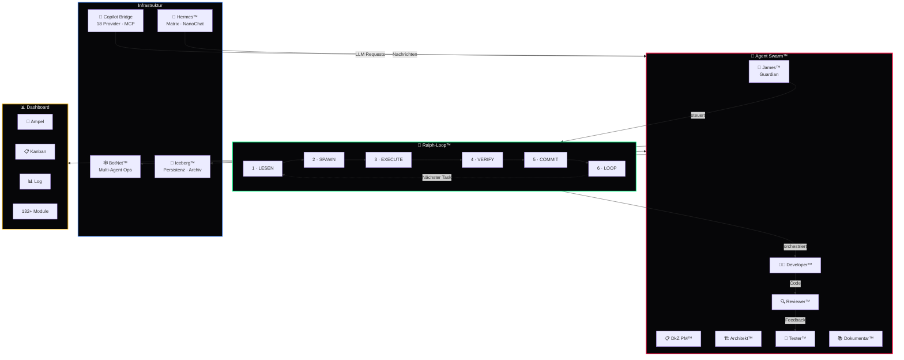

<div align="center">

# 🐝 Agent Swarm™

**Multi-Agent Orchestrierung des DEVKiTZ™ Ökosystems**

*6 Systeme · 8 Loops · 7 Agenten · 18 Provider · 132+ Module*

[](https://github.com/777/devkitz-ecosystem)
[](https://github.com/777/devkitz-ecosystem)
[](LICENSE)
[](https://nodejs.org)
[](https://expressjs.com)
[](https://duckdb.org)
[](https://iceberg.apache.org)
[](https://modelcontextprotocol.io)
[](#-bmad-agenten)
[](#-llm-provider)
[](#-dashboard--module)
[](#-loops--intervalle)
[](#-kern-systeme)
[](#-ampel-system)
[](https://microsoft.com)
[](https://apple.com)
[](https://kernel.org)
[](#-monitoring--health)
[](#-loops--intervalle)
[](#-loops--intervalle)

---

> **Agent Swarm™** ist das zentrale Nervensystem des DEVKiTZ™ Ökosystems.
> Es orchestriert 7 spezialisierte KI-Agenten über 8 parallele Loops, verbindet 18 LLM-Provider
> und steuert 132+ Dashboard-Module — alles mit Echtzeit-Ampel-Monitoring und Graceful Degradation.

</div>

---

## 📑 Inhaltsverzeichnis

- [🏗️ Architektur](#️-architektur)
- [⚙️ Kern-Systeme](#️-kern-systeme)
- [🤖 BMAD™ Agenten](#-bmad-agenten)
- [🔄 Loops & Intervalle](#-loops--intervalle)
- [🚦 Ampel-System](#-ampel-system)
- [🧠 LLM Provider](#-llm-provider)
- [📊 Dashboard & Module](#-dashboard--module)
- [🚀 Quick Start](#-quick-start)
- [📡 API Reference](#-api-reference)
- [🔗 Verknüpfte Repos](#-verknüpfte-repos)
- [📜 Lizenz](#-lizenz)

---

## 🏗️ Architektur

Das folgende Diagramm zeigt den Datenfluss zwischen den 6 Kern-Systemen, den BMAD™ Agenten und dem Dashboard:



---

## ⚙️ Kern-Systeme

Agent Swarm™ besteht aus 6 ineinandergreifenden Systemen, die zusammen das gesamte DEVKiTZ™ Ökosystem antreiben:

| # | System | Beschreibung | Technologie |
|:--|:-------|:-------------|:------------|
| 1 | 🐝 **Agent Swarm** | Zentrale Orchestrierung aller KI-Agenten. Verteilt Tasks, überwacht Ressourcen, koordiniert den Ralph-Loop™ und stellt sicher, dass jeder Agent mit frischem Kontext arbeitet. | Node.js, Express, WebSocket |
| 2 | 🔄 **Ralph-Loop™** | 6-Phasen Pipeline für kontextfreies Task-Processing. Jeder Task durchläuft LESEN → SPAWN → EXECUTE → VERIFY → COMMIT → LOOP. Kernprinzip: Frischer Kontext — kein Context Drift. | Event-Driven, JSON State |
| 3 | 🕸️ **BotNet™** | Multi-Agent Operations Layer. Ermöglicht parallele Agent-Ausführung, Agent-zu-Agent Kommunikation und dynamisches Scaling basierend auf Workload. | WebSocket, Message Queue |
| 4 | 🤖 **Copilot Bridge** | Universeller LLM-Connector mit Unterstützung für 18 Provider und MCP (Model Context Protocol). Intelligentes Routing, Fallback-Ketten und Token-Budgets. | REST, MCP, SSE |
| 5 | 📨 **Hermes™** | Kommunikations-Hub für Matrix-Protokoll, NanoChat und Ticket-Management. Async Messaging zwischen Agenten, Benutzern und externen Systemen. | Matrix SDK, REST |
| 6 | 🧊 **Iceberg™** | Daten-Persistenz und Archivierung auf Basis von Apache Iceberg + DuckDB. Dreifach-Verankerung aller Artefakte: Iceberg → Hub → Copilot. | DuckDB, Apache Iceberg |

---

## 🤖 BMAD™ Agenten

**B**lueprint → **M**apping → **A**nalyse → **D**esign — die 7 spezialisierten Agenten des DEVKiTZ™:

| # | Agent | Rolle | Aufgabe | Loop-Phase |
|:--|:------|:------|:--------|:-----------|
| 1 | 🎯 **James™** | Guardian | Überwacht alle Agenten, coded NICHT, steuert Context Pipeline | LESEN, LOOP |
| 2 | 📋 **DkZ PM™** | Product Manager | Erstellt `spec.md`, User Stories, priorisiert Backlog | LESEN |
| 3 | 🏗️ **DkZ Architekt™** | Architekt | Erstellt `plan.md`, definiert Tech-Stack und Architektur | SPAWN |
| 4 | 👨‍💻 **DkZ Developer™** | Coder | Ralph-Loop Executor — schreibt den gesamten Code | EXECUTE |
| 5 | 🔍 **DkZ Reviewer™** | CodeRabbit | Qualitätsprüfung, Code-Reviews, Security-Checks | VERIFY |
| 6 | 🧪 **DkZ Tester™** | Tester | Tests, Validierung, Regressionsprüfung | VERIFY |
| 7 | 📚 **DkZ Dokumentar™** | Dokumentation | README, Wiki, Walkthroughs, Learnings | COMMIT |

---

## 🔄 Loops & Intervalle

8 parallele Loops halten das System lebendig und synchron:

| # | Loop | Intervall | Status | Beschreibung |
|:--|:-----|:----------|:-------|:-------------|
| 1 | 🔄 **Ralph Loop** | Event-Driven | 🟢 Aktiv | Haupt-Pipeline — 6 Phasen pro Task, frischer Kontext |
| 2 | 🤖 **Copilot Suggest** | 30s | 🟢 Aktiv | Kontextbasierte Code-Vorschläge an Developer™ |
| 3 | 💾 **Auto-Save** | 60s | 🟢 Aktiv | Automatische Sicherung aller offenen Artefakte |
| 4 | 🗄️ **Backup** | 5 min | 🟢 Aktiv | Inkrementelle Backups nach Iceberg™ |
| 5 | 💚 **Health** | 15s | 🟢 Aktiv | Ampel-Status aller 6 Systeme prüfen |
| 6 | 🔁 **Update** | 10 min | 🟢 Aktiv | Dependency-Check und Version-Sync |
| 7 | 🏷️ **Triage** | Event-Driven | 🟢 Aktiv | Automatische Issue-Klassifizierung und Priorisierung |
| 8 | 🤝 **Dual-Agent** | Event-Driven | 🟢 Aktiv | Parallele Agent-Paare für Review + Test |

---

## 🚦 Ampel-System

Echtzeit-Monitoring aller Systeme mit dreistufiger Eskalation und Graceful Degradation:

| Stufe | Farbe | Bedeutung | Reaktion |
|:------|:------|:----------|:---------|
| 🟢 | `#00ff88` Grün | Alle Systeme operational | Normaler Betrieb |
| 🟡 | `#ffb800` Gelb | Degraded — eingeschränkte Funktion | Kein Token → Fallback-Provider, Feature-Reduktion |
| 🔴 | `#ff3b5c` Rot | Offline — kritischer Fehler | Kein Server → Offline-Modus, Dashboard läuft weiter |

**Graceful Degradation Prinzip:** Selbst wenn alle LLM-Provider ausfallen, bleibt das Dashboard voll funktionsfähig. Iceberg™ sichert alle Daten lokal, Hermes™ puffert Nachrichten, und der Ralph-Loop™ pausiert Tasks bis zur Wiederherstellung.

```javascript
// Ampel-Logik (vereinfacht)
function getSystemStatus(system) {
  if (system.healthy && system.token)  return '🟢 GRÜN';
  if (system.healthy && !system.token) return '🟡 GELB';
  return '🔴 ROT';
}
```

---

## 🧠 LLM Provider

Copilot Bridge verbindet 18 LLM-Provider über ein einheitliches Interface mit automatischem Fallback:

| # | Provider | Modelle | Typ | Priorität |
|:--|:---------|:--------|:----|:----------|
| 1 | **OpenAI** | GPT-4o, GPT-4.1, o3, o4-mini | Cloud | ⭐ Primär |
| 2 | **Anthropic** | Claude 4 Sonnet, Claude 4 Opus | Cloud | ⭐ Primär |
| 3 | **Google** | Gemini 2.5 Pro, Gemini 2.5 Flash | Cloud | ⭐ Primär |
| 4 | **xAI** | Grok 3, Grok 3 Mini | Cloud | Sekundär |
| 5 | **Mistral** | Mistral Large, Codestral, Devstral | Cloud | Sekundär |
| 6 | **DeepSeek** | DeepSeek-V3, DeepSeek-R1 | Cloud | Sekundär |
| 7 | **Meta** | Llama 4 Scout, Llama 4 Maverick | Local/Cloud | Sekundär |
| 8 | **Cohere** | Command R+, Embed | Cloud | Tertiär |
| 9 | **AI21** | Jamba 2 | Cloud | Tertiär |
| 10 | **Perplexity** | Sonar Pro, Sonar Deep Research | Cloud | Tertiär |
| 11 | **Groq** | Llama, Mixtral (Ultra-Fast) | Cloud | Tertiär |
| 12 | **Together AI** | Open-Source Mix | Cloud | Tertiär |
| 13 | **Fireworks** | Fast Inference | Cloud | Tertiär |
| 14 | **Replicate** | Model Zoo | Cloud | Tertiär |
| 15 | **HuggingFace** | Inference API | Cloud | Tertiär |
| 16 | **Ollama** | Lokale Modelle | Local | Fallback |
| 17 | **LM Studio** | Lokale Modelle | Local | Fallback |
| 18 | **Jan.ai** | Lokale Modelle | Local | Fallback |

---

## 📊 Dashboard & Module

Das DEVKiTZ™ Dashboard vereint **132+ Module** in einer einzigen Oberfläche — gebaut mit purem Vanilla HTML5, CSS3 und JavaScript ES6+ (kein Framework!):

| Kategorie | Module | Beispiele |
|:----------|:-------|:---------|
| 🎛️ **Core** | 12 | Navbar, Sidebar, Theme-Engine, Notification-Center |
| 📊 **Analytics** | 18 | Git-Stats, Code-Metriken, Performance-Monitor, Token-Tracker |
| 🤖 **KI-Agenten** | 14 | Agent-Dashboard, Copilot-Panel, BotNet-Control, Swarm-View |
| 📋 **Projektmanagement** | 16 | Kanban, Task-Manager, Timeline, Sprint-Board, Backlog |
| 📝 **Editor** | 11 | Code-Editor, Markdown-Preview, Diff-Viewer, Snippet-Manager |
| 🧊 **Daten** | 15 | WissenHub, Iceberg-Explorer, Query-Builder, Data-Catalog |
| 📨 **Kommunikation** | 10 | NanoChat, Matrix-Client, Ticket-System, Notification-Hub |
| 🛠️ **DevOps** | 14 | CI/CD Pipeline, Docker-Manager, Server-Monitor, Log-Viewer |
| 🎨 **Design** | 8 | Color-Picker, Icon-Browser, Component-Library, Theme-Editor |
| 🔒 **Security** | 7 | Auth-Manager, Key-Vault, Audit-Log, XSS-Shield |
| 📦 **Sonstiges** | 7+ | Backup-Manager, Settings, Help-Center, Changelog |

---

## 🚀 Quick Start

### 📋 Voraussetzungen

- **Node.js** 18+ und **npm** 9+
- **Git** 2.40+
- **DuckDB** CLI (optional, für direkte Queries)

### ⚡ Installation

```bash
# 1. Repository klonen
git clone https://github.com/777/devkitz-ecosystem.git
cd devkitz-ecosystem

# 2. Dependencies installieren
npm install

# 3. Umgebungsvariablen konfigurieren
cp .env.example .env
# → API-Keys für gewünschte LLM-Provider eintragen

# 4. Agent Swarm™ starten
npm run swarm:start

# 5. Dashboard öffnen
# → http://localhost:3000
```

### 🔧 Konfiguration

```json
{
  "swarm": {
    "agents": 7,
    "loops": 8,
    "ampel": { "healthInterval": 15000, "autoSave": 60000 },
    "iceberg": { "backupInterval": 300000, "catalog": "catalog.json" },
    "copilot": { "primaryProvider": "openai", "fallback": ["anthropic", "google"] }
  }
}
```

### ✅ Ersten Ralph-Loop™ starten

```bash
# Task in die Pipeline einspeisen
npm run ralph:task -- --spec "features/neue-funktion.md"

# Loop-Status prüfen
npm run ralph:status

# Alle Agenten-Logs anzeigen
npm run swarm:logs
```

---

## 📡 API Reference

Der ONTHERUN™ MCP Server stellt folgende Endpunkte bereit:

### 🐝 Swarm API

| Methode | Endpunkt | Beschreibung |
|:--------|:---------|:-------------|
| `GET` | `/api/swarm/status` | Status aller 6 Systeme + Ampel |
| `GET` | `/api/swarm/agents` | Liste aller 7 Agenten mit Status |
| `POST` | `/api/swarm/task` | Neuen Task in Ralph-Loop™ einspeisen |
| `DELETE` | `/api/swarm/task/:id` | Task abbrechen |

### 🔄 Ralph-Loop™ API

| Methode | Endpunkt | Beschreibung |
|:--------|:---------|:-------------|
| `GET` | `/api/ralph/status` | Aktuelle Loop-Phase und Task-Queue |
| `GET` | `/api/ralph/history` | Abgeschlossene Loop-Durchläufe |
| `POST` | `/api/ralph/spawn` | Manuellen SPAWN erzwingen |
| `PUT` | `/api/ralph/pause` | Loop pausieren / fortsetzen |

### 🤖 Copilot Bridge API

| Methode | Endpunkt | Beschreibung |
|:--------|:---------|:-------------|
| `POST` | `/api/copilot/chat` | LLM-Request über Provider-Router |
| `GET` | `/api/copilot/providers` | Verfügbare Provider + Status |
| `POST` | `/api/copilot/mcp` | MCP-Protokoll Endpunkt |
| `GET` | `/api/copilot/tokens` | Token-Verbrauch pro Provider |

### 🧊 Iceberg™ API

| Methode | Endpunkt | Beschreibung |
|:--------|:---------|:-------------|
| `GET` | `/api/iceberg/catalog` | Gesamter Artefakt-Katalog |
| `GET` | `/api/iceberg/artifact/:id` | Einzelnes Artefakt abrufen |
| `POST` | `/api/iceberg/archive` | Artefakt archivieren |
| `GET` | `/api/iceberg/stats` | Speicher- und Archiv-Statistiken |

---

## 🔗 Verknüpfte Repos

| Repository | Beschreibung | Status |
|:-----------|:-------------|:-------|
| [devkitz-ecosystem](https://github.com/777/devkitz-ecosystem) | 🏠 Mono-Repo — gesamtes DEVKiTZ™ Ökosystem | [](https://github.com/777/devkitz-ecosystem) |
| [devkitz-dashboard](https://github.com/777/devkitz-dashboard) | 📊 Dashboard mit 132+ Modulen | [](https://github.com/777/devkitz-dashboard) |
| [devkitz-vault](https://github.com/777/devkitz-vault) | 🧠 SecondBrain Obsidian Vault | [](https://github.com/777/devkitz-vault) |
| [ontherun-mcp](https://github.com/777/ontherun-mcp) | 🖥️ ONTHERUN™ MCP Server | [](https://github.com/777/ontherun-mcp) |
| [devkitz-copilot](https://github.com/777/devkitz-copilot) | 🤖 Copilot Bridge + Provider | [](https://github.com/777/devkitz-copilot) |
| [devkitz-hermes](https://github.com/777/devkitz-hermes) | 📨 Hermes™ Kommunikations-Hub | [](https://github.com/777/devkitz-hermes) |

---

## 📜 Lizenz

Dieses Projekt steht unter der **MIT License** — siehe [LICENSE](LICENSE) für Details.

---

<div align="center">

**Built with 🔥 by [DEVKiTZ™](https://github.com/777/devkitz-ecosystem)**

`v2.0` · `2026` · `#060608`

*🐝 Agent Swarm™ — Wenn ein Agent nicht reicht, nimm sieben.*

[](https://github.com/777/devkitz-ecosystem)

</div>
