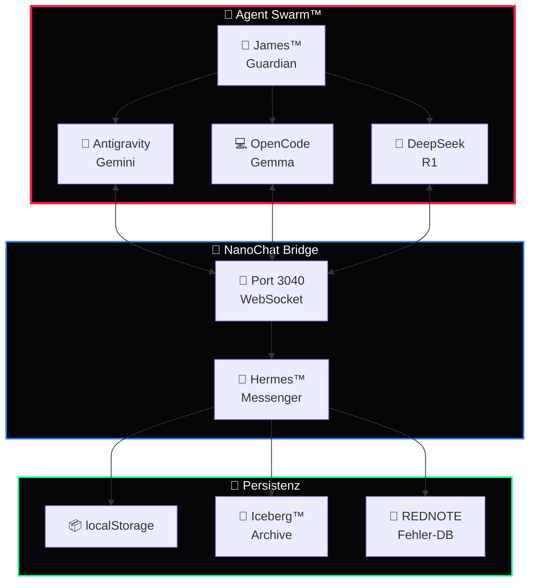

<div align="center">

# 🤖 Agent Swarm™

### Multi-Agent Orchestrierung · BotNet™ · NanoChat · Hermes™

*Autonome KI-Agent-Schwärme für das DEVKiTZ™ Ökosystem — Koordination, Kommunikation, Kollaboration*

---


</div>

---

## 📖 Überblick

**Agent Swarm™** ist das Multi-Agent-Orchestrierungssystem von DEVKiTZ™. Es koordiniert autonome KI-Agenten über die **NanoChat Bridge** (Port 3040), ermöglicht Cross-Agent-Kommunikation und verwaltet den gesamten Agent-Lifecycle — von Spawn bis Shutdown.

> **Kernprinzip:** Agenten arbeiten autonom in ihrem Scope, kommunizieren über standardisierte Protokolle und werden durch James™ überwacht.

---

## 🏛️ Architektur



---

## 🤖 Agent Fleet

| # | Agent | Runtime | Kanal | Status |
|:--|:------|:--------|:------|:-------|
| 1 | 🎯 **James™** | Guardian | Dashboard | `🟢 Active` |
| 2 | 🤖 **Antigravity** | Gemini | NanoBot | `🟢 Active` |
| 3 | 💻 **OpenCode** | Gemma 4 | NanoBot | `🟢 Active` |
| 4 | 🔬 **DeepSeek** | R1 Cloud | API | `🟡 On-Demand` |
| 5 | 📋 **DkZ PM™** | BMAD | Internal | `🟢 Defined` |
| 6 | 🏗️ **DkZ Architekt™** | BMAD | Internal | `🟢 Defined` |
| 7 | 👨‍💻 **DkZ Developer™** | BMAD | Internal | `🟢 Defined` |

---

## 🌉 NanoChat Bridge

```
Agent ←→ NanoChat Bridge (Port 3040) ←→ Dashboard
  ↕                                        ↕
REDNOTE.json                          localStorage
```

### Nachrichtenformat

```json
{
  "from": "antigravity",
  "to": "dashboard",
  "type": "status",
  "payload": { "module": "blog-gallery", "status": "complete" },
  "timestamp": "2026-05-28T16:00:00Z"
}
```

---

## 📁 Struktur

```
agent-swarm/
├── README.md           # Diese Datei
├── botnet/             # NanoBot Fleet
│   ├── nanobot-antigravity.js
│   └── nanobot-opencode.js
├── bridge/             # NanoChat Bridge
│   └── nanochat-server.js
├── hermes/             # Messenger-System
│   └── hermes-core.js
├── iceberg/            # Archiv-System
│   └── catalog.json
└── health/             # Health Checks
    └── swarm-health.js
```

---

## 🔗 Links

| Resource | Link |
|:---------|:-----|
| 🏠 Dashboard | [D-VKITZ.github.io](https://github.com/D-VKITZ/D-VKITZ.github.io) |
| 🤖 BMAD™ | [bmad-framework](https://github.com/D-VKITZ/bmad-framework) |
| 📊 Projects | [GitHub Projects](https://github.com/orgs/D-VKITZ/projects) |

---

<div align="center">

*Teil des [DEVKiTZ™](https://github.com/D-VKITZ) Ökosystems · Made with ❤️ by 777*

</div>