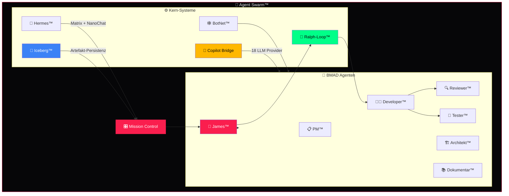

<](https://github.com/D-VKITZ/agent-swarm)
[](#-8-loops)
[](https://github.com/D-VKITZ/bmad-framework)
[](./LICENSE)

---

*6 Kern-Systeme · 8 Loops · Ampel-Monitoring · Graceful Degradation*

</div>

---

## 🏗️ Architektur



---

## ⚙️ 6 Kern-Systeme

| # | System | Team | Beschreibung | Ordner |
|:--|:-------|:-----|:-------------|:-------|
| 1 | 🐝 **Agent Swarm** | `agent-swarm` | Orchestrierung aller KI-Agenten | [`agent-swarm/`](./agent-swarm/) |
| 2 | 🔄 **Ralph-Loop™** | `ralph-loop` | 6-Phasen Execution Pipeline | [`ralph-loop/`](./ralph-loop/) |
| 3 | 🕸️ **BotNet™** | `botnet-ops` | Multi-Agent Operations, Deployment | [`botnet-ops/`](./botnet-ops/) |
| 4 | 🤖 **Copilot Bridge** | `copilot-bridge` | 18 LLM Provider, MCP Integration | [`copilot-bridge/`](./copilot-bridge/) |
| 5 | 📨 **Hermes™** | `hermes-comms` | Matrix Bridge, NanoChat, Tickets | [`hermes-comms/`](./hermes-comms/) |
| 6 | 🧊 **Iceberg™** | `iceberg-data` | Daten-Persistenz, Artefakt-Archiv | [`iceberg-data/`](./iceberg-data/) |

---

## 🔄 8 Loops

| # | Loop | Intervall | Beschreibung |
|:--|:-----|:----------|:-------------|
| 1 | 🔄 **Ralph Loop** | Pro Task | LESEN → SPAWN → EXECUTE → VERIFY → COMMIT → LOOP |
| 2 | 💡 **Copilot Suggest** | 30s | Kontextbezogene Vorschläge generieren |
| 3 | 💾 **Auto-Save** | 60s | Automatisches Speichern aller Änderungen |
| 4 | 📦 **Backup** | 5min | Incremental Backup nach Iceberg |
| 5 | 🏥 **Health** | 30s | System-Health-Check aller Systeme |
| 6 | 🔄 **Update** | 10min | Feature-Updates + Sync prüfen |
| 7 | 🎫 **Triage** | 5min | Issue-Triage und Auto-Labeling |
| 8 | 🤝 **Dual-Agent** | Realtime | Dual-Agent Koordination |

---

## 🚦 Ampel-System

| Status | Bedeutung | Aktion |
|:-------|:----------|:-------|
| 🟢 **Grün** | System OK | Normalbetrieb |
| 🟡 **Gelb** | Degraded | Funktioniert eingeschränkt (z.B. kein Token) |
| 🔴 **Rot** | Offline | System nicht erreichbar |

### Graceful Degradation

```
Kein Token    → 🟡 Gelb (Features eingeschränkt)
Kein Server   → 🔴 Rot (Offline-Mode)
Dashboard     → ✅ Läuft IMMER weiter (Offline-First)
```

---

## 🚀 Quick Start

```bash
# 1. Repo klonen
git clone https://github.com/D-VKITZ/agent-swarm.git
cd agent-swarm

# 2. Dashboard öffnen
open dashboard/index.html

# 3. Konfiguration prüfen
cat agent-swarm/swarm-config.json
```

---

## 🔗 Verknüpfte Repos

| System | Repo | Beschreibung |
|:-------|:-----|:-------------|
| 🎯 BMAD™ | [bmad-framework](https://github.com/D-VKITZ/bmad-framework) | 7 Agenten Methodik |
| 🌐 Dashboard | [D-VKITZ.github.io](https://github.com/D-VKITZ/D-VKITZ.github.io) | 132+ Module live |
| 🏠 Org | [D-VKITZ](https://github.com/D-VKITZ) | GitHub Organisation |

---

<div align="center">

**DEVKiTZ™** — Vollständiges KI-Entwickler-Ökosystem

*Built with 🐝 by 777*

</div>
]]>
