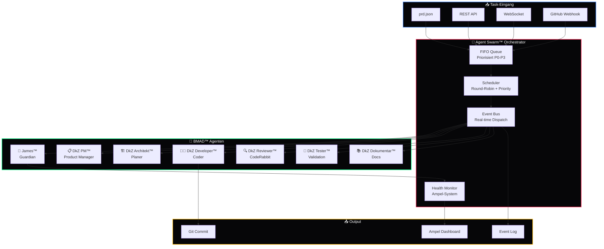

<div align="center">

# 🐝 Agent Swarm™

### Intelligente Multi-Agenten Orchestrierung für DEVKiTZ™

[](https://github.com/777/devkitz-ecosystem)
[](https://github.com/777/devkitz-ecosystem)
[](https://github.com/777/devkitz-ecosystem)
[](https://github.com/777/devkitz-ecosystem)
[](https://github.com/777/devkitz-ecosystem)
[](https://github.com/777/devkitz-ecosystem)
[](https://github.com/777/devkitz-ecosystem)
[](https://github.com/777/devkitz-ecosystem)
[](https://github.com/777/devkitz-ecosystem)
[](https://github.com/777/devkitz-ecosystem)
[](https://github.com/777/devkitz-ecosystem)
[](https://github.com/777/devkitz-ecosystem)
[](https://github.com/777/devkitz-ecosystem)
[](https://github.com/777/devkitz-ecosystem)
[](https://github.com/777/devkitz-ecosystem)
[](https://github.com/777/devkitz-ecosystem)

**Agent Swarm™** ist das zentrale Nervensystem des DEVKiTZ™ Ökosystems — ein Event-getriebener Orchestrator, der 7 spezialisierte BMAD™-Agenten über 8 parallele Loops koordiniert. Jeder Agent besitzt einen klar definierten Verantwortungsbereich und kommuniziert über eine priorisierte FIFO-Queue.

[Architektur](#-architektur) · [Agenten](#-bmad-agenten) · [Event-System](#-event-system) · [API](#-api-referenz) · [Konfiguration](#%EF%B8%8F-konfiguration)

</div>

---

## 🏗️ Architektur

Das folgende Diagramm zeigt den vollständigen Orchestrierungs-Flow — von eingehenden Tasks über die FIFO-Queue bis zur Ausführung durch die spezialisierten Agenten und die Rückmeldung ans Ampel-Dashboard.



---

## 🤖 BMAD™ Agenten

Die 7 Agenten bilden das Rückgrat der BMAD™-Methodik (Blueprint → Mapping → Analyse → Design). Jeder Agent hat einen isolierten Verantwortungsbereich und wird vom Orchestrator gezielt aktiviert.

| # | Agent | Rolle | Verantwortung | Auto-Start |
|:--|:------|:------|:--------------|:-----------|
| 1 | 🎯 **James™** | Guardian | Überwacht alle Agenten, enforced Constitution, coded **NICHT** | ✅ Immer |
| 2 | 📋 **DkZ PM™** | Product Manager | Erstellt `spec.md`, User Stories, Akzeptanzkriterien | Bei neuem Feature |
| 3 | 🏗️ **DkZ Architekt™** | Planer | Erstellt `plan.md`, definiert Tech-Stack, Modul-Grenzen | Bei neuem Feature |
| 4 | 👨‍💻 **DkZ Developer™** | Coder | Schreibt Code im Ralph-Loop™, führt Tasks atomar aus | Bei `EXECUTE` Phase |
| 5 | 🔍 **DkZ Reviewer™** | CodeRabbit | Pull-Request-Reviews, Code-Qualität, Regelwerk-Check | Nach jedem Commit |
| 6 | 🧪 **DkZ Tester™** | Validation | E2E-Tests, Screenshot-Vergleiche, Regression | Nach Review |
| 7 | 📚 **DkZ Dokumentar™** | Docs | README, Wiki, CHANGELOG, Learnings-Einträge | Nach Merge |

---

## 🔄 Agent-Lifecycle Management

Jeder Agent durchläuft einen definierten Lebenszyklus. Der Orchestrator verwaltet den State jedes Agenten und stellt sicher, dass bei Fehlern ein Graceful Recovery greift.

```javascript
// Agent-Lifecycle States
const AgentState = {
  IDLE:      'idle',       // Bereit, wartet auf Task
  SPAWNING:  'spawning',   // Frischer Kontext wird geladen
  ACTIVE:    'active',     // Führt Task aus
  BLOCKED:   'blocked',    // Wartet auf Dependency
  RECOVERY:  'recovery',   // Fehler erkannt, Auto-Recovery
  COMPLETED: 'completed'   // Task abgeschlossen
};

// Orchestrator spawnt Agent mit frischem Kontext
function spawnAgent(agentType, taskPayload) {
  const agent = {
    id: `agent-${agentType}-${Date.now()}`,
    type: agentType,
    state: AgentState.SPAWNING,
    context: loadFreshContext(taskPayload),
    timeout: 30 * 60 * 1000,  // 30 Minuten
    retries: 3,
    priority: taskPayload.priority || 'P2'
  };
  
  eventBus.emit('agent:spawned', agent);
  return agent;
}
```

---

## ⚡ Event-System

Das Event-System ist das Kommunikations-Backbone des Swarm. Alle Agenten und Subsysteme kommunizieren ausschließlich über typisierte Events — niemals direkte Aufrufe.

| Event | Emitter | Listener | Beschreibung |
|:------|:--------|:---------|:-------------|
| `task:created` | API / PRD Parser | Scheduler | Neuer Task in der Queue |
| `agent:spawned` | Orchestrator | James™, Dashboard | Agent wurde gestartet |
| `agent:completed` | Agent | Orchestrator | Task abgeschlossen |
| `agent:failed` | Agent | Recovery Manager | Fehler aufgetreten |
| `health:check` | Health Monitor | Alle Agenten | Heartbeat-Request |
| `health:response` | Agent | Health Monitor | Heartbeat-Antwort |
| `ampel:update` | Health Monitor | Dashboard | Ampel-Status geändert |
| `commit:ready` | Developer™ | Reviewer™ | Code zum Review bereit |

---

## 🚦 Fehlerbehandlung & Recovery

Der Orchestrator implementiert ein dreistufiges Fehlerbehandlungs-System mit automatischem Retry und Graceful Degradation.

```javascript
// Fehlerbehandlung mit Retry + Escalation
async function handleAgentFailure(agent, error) {
  agent.state = AgentState.RECOVERY;
  
  // Stufe 1: Auto-Retry (bis 3x)
  if (agent.retries > 0) {
    agent.retries--;
    eventBus.emit('agent:retry', { agent, attempt: 3 - agent.retries });
    return respawnAgent(agent);
  }
  
  // Stufe 2: Graceful Degradation
  eventBus.emit('ampel:update', { status: 'gelb', agent: agent.type });
  
  // Stufe 3: Eskalation an James™
  eventBus.emit('escalation:james', {
    agent: agent.type,
    error: error.message,
    priority: 'P0'
  });
}
```

| Stufe | Trigger | Aktion | Ampel |
|:------|:--------|:-------|:------|
| 1 — Retry | Agent-Fehler | Auto-Respawn (max. 3x) | 🟢 Grün |
| 2 — Degradation | Retry erschöpft | Feature deaktivieren, Dashboard warnen | 🟡 Gelb |
| 3 — Eskalation | Kritischer Fehler | James™ benachrichtigen, 777 alarmieren | 🔴 Rot |

---

## 📡 API-Referenz

| Endpoint | Methode | Beschreibung |
|:---------|:--------|:-------------|
| `/api/swarm/status` | `GET` | Aktueller Swarm-Status aller Agenten |
| `/api/swarm/agents` | `GET` | Liste aktiver Agenten mit State |
| `/api/swarm/spawn` | `POST` | Neuen Agent manuell starten |
| `/api/swarm/kill/:id` | `DELETE` | Agent stoppen |
| `/api/swarm/events` | `WS` | WebSocket-Stream aller Events |
| `/api/swarm/queue` | `GET` | Aktuelle FIFO-Queue einsehen |
| `/api/swarm/health` | `GET` | Health-Check Ergebnis (Ampel) |

---

## ⚙️ Konfiguration

```json
{
  "swarm": {
    "maxConcurrentAgents": 4,
    "queueType": "FIFO",
    "priorities": ["P0", "P1", "P2", "P3"],
    "healthCheckInterval": 30000,
    "agentTimeout": 1800000,
    "maxRetries": 3,
    "gracefulShutdown": true,
    "eventLog": "logs/swarm-events.jsonl",
    "dashboard": {
      "port": 3100,
      "websocket": true,
      "ampelEnabled": true
    }
  }
}
```

---

## 🔗 Verwandte Systeme

| System | Beschreibung | Link |
|:-------|:-------------|:-----|
| 🔄 Ralph-Loop™ | 6-Phasen Execution Pipeline | [ralph-loop/](../ralph-loop/) |
| 🕸️ BotNet™ | Multi-Agent Deployment | [botnet-ops/](../botnet-ops/) |
| 🤖 Copilot Bridge™ | 18 LLM Provider | [copilot-bridge/](../copilot-bridge/) |
| 📨 Hermes™ | Kommunikation & Chat | [hermes-comms/](../hermes-comms/) |
| 🧊 Iceberg™ | Daten-Persistenz | [iceberg-data/](../iceberg-data/) |

---

<div align="center">

**🐝 Agent Swarm™** — Teil des [DEVKiTZ™ Ökosystems](https://github.com/777/devkitz-ecosystem)

`Built with 🔥 by 777 · Powered by BMAD™ · Coordinated by James™`

[](https://github.com/777/devkitz-ecosystem)

</div>
