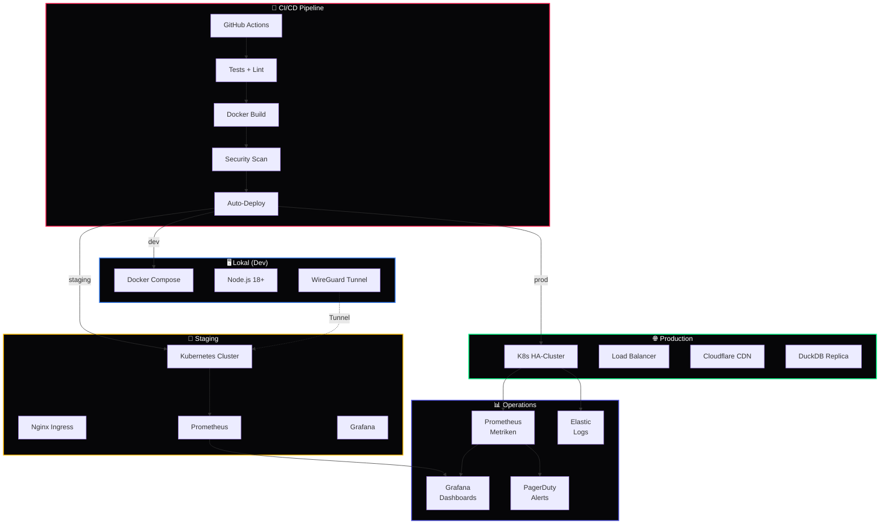

<div align="center">

# 🕸️ BotNet™

### Multi-Agent Operations & Deployment Infrastructure

[](https://github.com/777/devkitz-ecosystem)
[](https://github.com/777/devkitz-ecosystem)
[](https://github.com/777/devkitz-ecosystem)
[](https://github.com/777/devkitz-ecosystem)
[](https://github.com/777/devkitz-ecosystem)
[](https://github.com/777/devkitz-ecosystem)
[](https://github.com/777/devkitz-ecosystem)
[](https://github.com/777/devkitz-ecosystem)
[](https://github.com/777/devkitz-ecosystem)
[](https://github.com/777/devkitz-ecosystem)
[](https://github.com/777/devkitz-ecosystem)
[](https://github.com/777/devkitz-ecosystem)
[](https://github.com/777/devkitz-ecosystem)
[](https://github.com/777/devkitz-ecosystem)
[](https://github.com/777/devkitz-ecosystem)
[](https://github.com/777/devkitz-ecosystem)

**BotNet™** ist die Operations- und Deployment-Schicht des DEVKiTZ™ Ökosystems. Es orchestriert die Infrastruktur für alle Agenten — von der lokalen Entwicklung über Staging bis zur Produktion. Automatisierte CI/CD-Pipelines, Container-Management und Health-Monitoring sorgen für reibungslosen Betrieb.

[Architektur](#-infrastruktur-architektur) · [Deployment](#-deployment-strategien) · [Monitoring](#-monitoring--alerting) · [Koordination](#-multi-agent-coordination) · [Config](#%EF%B8%8F-konfiguration)

</div>

---

## 🏗️ Infrastruktur-Architektur

BotNet™ verwaltet drei Deployment-Tiers: **Lokal** für Entwicklung, **Staging** für Integration und **Production** für den Live-Betrieb. Jedes Tier hat eigene Sicherheits- und Monitoring-Konfigurationen.



---

## 🚀 Deployment-Strategien

BotNet™ unterstützt mehrere Deployment-Modi, je nach Risiko und Verfügbarkeits-Anforderungen.

| Strategie | Beschreibung | Risiko | Downtime | Einsatz |
|:----------|:-------------|:-------|:---------|:--------|
| **Rolling Update** | Pods werden nacheinander ersetzt | Niedrig | Keine | Standard für Module |
| **Blue-Green** | Komplettes Environment-Swap | Mittel | < 5s | Dashboard Releases |
| **Canary** | 10% Traffic auf neuer Version | Niedrig | Keine | Kritische Features |
| **Recreate** | Alles stoppen, neu starten | Hoch | 30-60s | Breaking Changes |
| **Feature Flags** | Code deployed, Feature deaktiviert | Minimal | Keine | A/B-Tests |

```yaml
# .github/workflows/deploy.yml
name: 🕸️ BotNet™ Deploy

on:
  push:
    branches: [main]
  workflow_dispatch:
    inputs:
      strategy:
        description: 'Deployment-Strategie'
        required: true
        default: 'rolling'
        type: choice
        options: [rolling, blue-green, canary, recreate]

jobs:
  deploy:
    runs-on: ubuntu-latest
    steps:
      - uses: actions/checkout@v4
      
      - name: 🐳 Docker Build
        run: docker build -t devkitz/swarm:${{ github.sha }} .
      
      - name: 🔍 Security Scan
        run: trivy image devkitz/swarm:${{ github.sha }}
      
      - name: 🚀 Deploy to K8s
        run: |
          kubectl set image deployment/swarm \
            swarm=devkitz/swarm:${{ github.sha }} \
            --record
```

---

## 🐳 Container-Konfiguration

Jeder Agent wird als eigener Container mit definierten Ressourcen-Limits deployed. James™ erhält besondere Privilegien als Guardian.

```dockerfile
# Dockerfile — Agent Container
FROM node:18-alpine AS base

LABEL maintainer="777 <dev@devkitz.com>"
LABEL description="DEVKiTZ™ Agent Container"

WORKDIR /app

COPY package*.json ./
RUN npm ci --production

COPY . .

HEALTHCHECK --interval=30s --timeout=5s --retries=3 \
  CMD curl -f http://localhost:3000/health || exit 1

EXPOSE 3000
USER node

CMD ["node", "server.js"]
```

| Container | CPU Limit | RAM Limit | Replicas | Port |
|:----------|:----------|:----------|:---------|:-----|
| `james-guardian` | 500m | 512Mi | 1 | 3001 |
| `dkz-developer` | 1000m | 1Gi | 2 | 3002 |
| `dkz-reviewer` | 500m | 512Mi | 1 | 3003 |
| `dkz-tester` | 750m | 768Mi | 1 | 3004 |
| `swarm-orchestrator` | 750m | 768Mi | 1 | 3100 |
| `hermes-bridge` | 250m | 256Mi | 1 | 3200 |
| `iceberg-store` | 500m | 1Gi | 1 | 3300 |

---

## 📊 Monitoring & Alerting

Das Monitoring-System basiert auf dem **Prometheus → Grafana → PagerDuty** Stack. Die Ampel im Dashboard reflektiert den aggregierten Health-Status aller Komponenten.

| Metrik | Beschreibung | Warning | Critical |
|:-------|:-------------|:--------|:---------|
| `agent_uptime_seconds` | Laufzeit pro Agent | < 1h | < 5min |
| `task_duration_seconds` | Dauer pro Task | > 20min | > 30min |
| `queue_depth` | Tasks in Warteschlange | > 10 | > 25 |
| `error_rate_percent` | Fehlerrate pro Minute | > 5% | > 15% |
| `memory_usage_bytes` | RAM-Verbrauch pro Container | > 80% | > 95% |
| `cpu_usage_percent` | CPU-Auslastung | > 70% | > 90% |
| `git_commit_failures` | Fehlgeschlagene Commits | > 0 | > 3 |

---

## 🤝 Multi-Agent Coordination

BotNet™ koordiniert die Kommunikation zwischen verteilten Agent-Instanzen über einen Message Bus. Jeder Agent meldet seinen Status und empfängt Aufträge über definierte Channels.

```javascript
// Multi-Agent Coordination Layer
const coordination = {
  // Agent-Discovery über Service-Registry
  async discoverAgents() {
    const services = await k8s.listServices({ 
      label: 'app=devkitz-agent' 
    });
    return services.map(s => ({
      name: s.metadata.name,
      endpoint: `http://${s.spec.clusterIP}:${s.spec.ports[0].port}`,
      status: s.metadata.annotations?.status || 'unknown'
    }));
  },

  // Heartbeat-Monitoring
  async checkHeartbeats(agents) {
    const results = await Promise.allSettled(
      agents.map(a => fetch(`${a.endpoint}/health`, { 
        timeout: 5000 
      }))
    );
    
    return results.map((r, i) => ({
      agent: agents[i].name,
      healthy: r.status === 'fulfilled' && r.value.ok,
      ampel: r.status === 'fulfilled' ? 'grün' : 'rot'
    }));
  }
};
```

---

## 🔐 Sicherheit

| Maßnahme | Tool | Beschreibung |
|:---------|:-----|:-------------|
| Container Scanning | Trivy | Schwachstellen-Scan bei jedem Build |
| Secrets Management | SOPS + Age | Verschlüsselte Konfiguration |
| Network Policies | K8s NetworkPolicy | Inter-Container Firewall |
| SSH Access | WireGuard | Verschlüsselte Tunnel |
| TLS Termination | Nginx Ingress | Let's Encrypt Zertifikate |
| RBAC | K8s RBAC | Rollen-basierte Zugriffskontrolle |

---

## ⚙️ Konfiguration

```json
{
  "botnet": {
    "environment": "production",
    "deployment": {
      "strategy": "rolling",
      "maxSurge": "25%",
      "maxUnavailable": 0
    },
    "monitoring": {
      "prometheus": { "port": 9090, "scrapeInterval": "15s" },
      "grafana": { "port": 3000, "dashboards": "auto" },
      "alerting": { "provider": "pagerduty", "severity": "P1" }
    },
    "backup": {
      "type": "incremental",
      "schedule": "0 2 * * *",
      "retention": "30d",
      "destination": "s3://devkitz-backups/"
    },
    "wireguard": {
      "enabled": true,
      "endpoint": "vpn.devkitz.com:51820"
    }
  }
}
```

---

## 🔗 Verwandte Systeme

| System | Zusammenspiel | Link |
|:-------|:-------------|:-----|
| 🐝 Agent Swarm™ | Orchestriert die Agenten, die BotNet deployed | [agent-swarm/](../agent-swarm/) |
| 🔄 Ralph-Loop™ | Tasks die BotNet-Deployment triggern | [ralph-loop/](../ralph-loop/) |
| 🤖 Copilot Bridge™ | LLM-Container werden von BotNet verwaltet | [copilot-bridge/](../copilot-bridge/) |
| 📨 Hermes™ | Alerts und Notifications | [hermes-comms/](../hermes-comms/) |
| 🧊 Iceberg™ | Backup-Daten werden persistent gespeichert | [iceberg-data/](../iceberg-data/) |

---

<div align="center">

**🕸️ BotNet™** — Teil des [DEVKiTZ™ Ökosystems](https://github.com/777/devkitz-ecosystem)

`Built with 🔥 by 777 · Docker Ready · K8s Compatible · WireGuard Secured`

[](https://github.com/777/devkitz-ecosystem)

</div>
