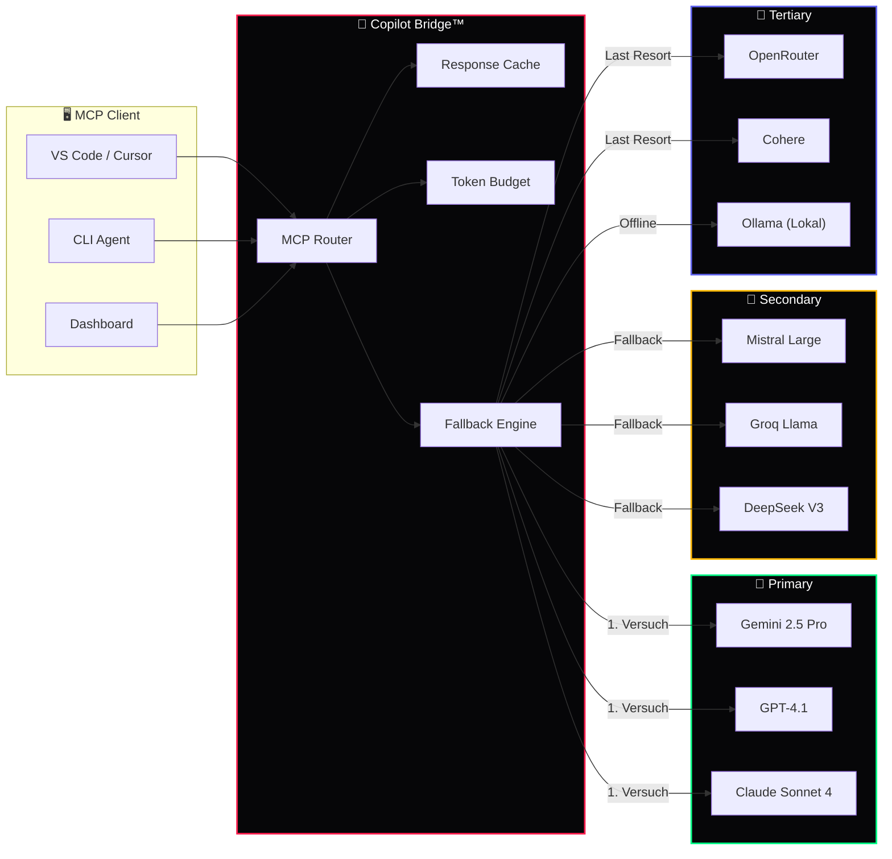

<div align="center">

# 🤖 Copilot Bridge™

### 18 LLM Provider — Ein einheitliches MCP-Interface

[](https://github.com/777/devkitz-ecosystem)
[](https://github.com/777/devkitz-ecosystem)
[](https://github.com/777/devkitz-ecosystem)
[](https://github.com/777/devkitz-ecosystem)
[](https://github.com/777/devkitz-ecosystem)
[](https://github.com/777/devkitz-ecosystem)
[](https://github.com/777/devkitz-ecosystem)
[](https://github.com/777/devkitz-ecosystem)
[](https://github.com/777/devkitz-ecosystem)
[](https://github.com/777/devkitz-ecosystem)
[](https://github.com/777/devkitz-ecosystem)
[](https://github.com/777/devkitz-ecosystem)
[](https://github.com/777/devkitz-ecosystem)
[](https://github.com/777/devkitz-ecosystem)
[](https://github.com/777/devkitz-ecosystem)
[](https://github.com/777/devkitz-ecosystem)

**Copilot Bridge™** vereinheitlicht 18 verschiedene LLM-Provider hinter einem einzigen MCP-kompatiblen Interface. Automatisches Fallback, intelligentes Routing, Token-Budgets und SSE-Streaming machen den Zugriff auf KI-Modelle nahtlos — egal ob Gemini, GPT, Claude oder lokale Modelle.

[Provider](#-provider-übersicht) · [MCP](#-mcp-integration) · [Fallback](#-fallback-strategie) · [Streaming](#-streaming--caching) · [API](#-api-referenz) · [Config](#%EF%B8%8F-konfiguration)

</div>

---

## 📋 Provider-Übersicht

Alle 18 Provider sind über die Copilot Bridge™ angebunden. Der Orchestrator wählt automatisch den besten Provider basierend auf Task-Typ, Latenz und Verfügbarkeit.

| # | Provider | Modell | Context Window | Stärken | Tier |
|:--|:---------|:-------|:---------------|:--------|:-----|
| 1 | **Google** | Gemini 2.5 Pro | 1M Tokens | Code, Multimodal, Reasoning | 🥇 Primary |
| 2 | **OpenAI** | GPT-4.1 | 128K Tokens | Allround, Function Calling | 🥇 Primary |
| 3 | **Anthropic** | Claude Sonnet 4 | 200K Tokens | Code, Analyse, Safety | 🥇 Primary |
| 4 | **Mistral** | Mistral Large | 128K Tokens | EU-Compliance, Multilingual | 🥈 Secondary |
| 5 | **Groq** | Llama 3.3 70B | 128K Tokens | Ultra-Speed, Open Source | 🥈 Secondary |
| 6 | **DeepSeek** | DeepSeek V3 | 128K Tokens | Code, Math, Reasoning | 🥈 Secondary |
| 7 | **Alibaba** | Qwen 3 | 128K Tokens | Multilingual, Code | 🥈 Secondary |
| 8 | **xAI** | Grok 3 | 128K Tokens | Realtime-Wissen, Code | 🥈 Secondary |
| 9 | **Cohere** | Command R+ | 128K Tokens | RAG, Enterprise Search | 🥉 Tertiary |
| 10 | **OpenRouter** | Multi-Model Hub | Variabel | Routing, Fallback-Pool | 🥉 Tertiary |
| 11 | **Together AI** | Mixtral / Llama | 32K Tokens | Günstig, Open-Source | 🥉 Tertiary |
| 12 | **Fireworks AI** | Diverse Modelle | 32K Tokens | Low-Latency Inference | 🥉 Tertiary |
| 13 | **Perplexity** | Sonar Pro | 128K Tokens | Online-Search, Citations | 🔧 Spezialist |
| 14 | **Ollama** | Lokale Modelle | 8-128K | Offline, Privat, Lokal | 🔧 Spezialist |
| 15 | **LM Studio** | GGUF Modelle | 8-32K | Desktop-lokal, GUI | 🔧 Spezialist |
| 16 | **HuggingFace** | Inference API | Variabel | Open-Source Hub | 🔧 Spezialist |
| 17 | **Cerebras** | Llama 3.3 70B | 128K Tokens | Wafer-Scale Speed | 🔧 Spezialist |
| 18 | **Sambanova** | Llama / Qwen | 128K Tokens | Enterprise Speed | 🔧 Spezialist |

---

## 🔌 MCP-Integration

Die Bridge implementiert das **Model Context Protocol (MCP)** als einheitliche Schnittstelle. Jeder Provider wird über einen standardisierten Adapter angesprochen — das ONTHERUN™ MCP Server Backend koordiniert die Verbindungen.



---

## 🔄 Fallback-Strategie

Das dreistufige Fallback-System stellt sicher, dass **niemals** ein Task an einem fehlenden LLM-Provider scheitert. Selbst bei komplettem Cloud-Ausfall springt Ollama als lokaler Fallback ein.

```javascript
// Fallback-Chain mit automatischem Retry
const fallbackChain = [
  // Tier 1 — Primary (parallel race)
  { providers: ['gemini', 'gpt4', 'claude'], mode: 'race', timeout: 15000 },
  
  // Tier 2 — Secondary (sequential)
  { providers: ['mistral', 'groq', 'deepseek', 'qwen'], mode: 'sequential', timeout: 20000 },
  
  // Tier 3 — Tertiary + Lokal
  { providers: ['openrouter', 'cohere', 'together'], mode: 'sequential', timeout: 30000 },
  
  // Last Resort — Offline-fähig
  { providers: ['ollama', 'lmstudio'], mode: 'sequential', timeout: 60000 }
];

async function queryWithFallback(prompt, options = {}) {
  for (const tier of fallbackChain) {
    try {
      if (tier.mode === 'race') {
        return await Promise.race(
          tier.providers.map(p => callProvider(p, prompt, tier.timeout))
        );
      }
      for (const provider of tier.providers) {
        try {
          return await callProvider(provider, prompt, tier.timeout);
        } catch (e) {
          eventBus.emit('provider:failed', { provider, error: e.message });
          continue;
        }
      }
    } catch (e) { continue; }
  }
  throw new AllProvidersFailedError('Kein Provider verfügbar');
}
```

| Tier | Strategie | Timeout | Modus | Beschreibung |
|:-----|:----------|:--------|:------|:-------------|
| 🥇 Primary | Race | 15s | Parallel | Schnellster gewinnt |
| 🥈 Secondary | Sequential | 20s | Nacheinander | Erster Erfolg zählt |
| 🥉 Tertiary | Sequential | 30s | Nacheinander | Breiterer Pool |
| 🔧 Lokal | Sequential | 60s | Nacheinander | Offline-Fallback |

---

## 📡 Streaming & Caching

Copilot Bridge™ unterstützt **Server-Sent Events (SSE)** für Echtzeit-Streaming und einen intelligenten Response-Cache, der identische Anfragen dedupliziert.

```javascript
// SSE Streaming an den Client
app.get('/api/copilot/stream', async (req, res) => {
  res.setHeader('Content-Type', 'text/event-stream');
  res.setHeader('Cache-Control', 'no-cache');
  res.setHeader('Connection', 'keep-alive');
  
  const stream = await bridge.streamCompletion({
    model: req.query.model || 'auto',
    prompt: req.query.prompt,
    maxTokens: parseInt(req.query.maxTokens) || 4096
  });
  
  for await (const chunk of stream) {
    res.write(`data: ${JSON.stringify(chunk)}\n\n`);
  }
  
  res.write('data: [DONE]\n\n');
  res.end();
});
```

| Feature | Beschreibung | Standard |
|:--------|:-------------|:---------|
| SSE Streaming | Token-by-Token Output | Aktiviert |
| Response Cache | SHA-256 Hash Dedup | 1h TTL |
| Token Budget | Pro-Provider Limits | 100K/Tag |
| Rate Limiting | Anfragen/Minute | 60 RPM |
| Retry with Backoff | Exponential Backoff | 3 Versuche |

---

## 📡 API-Referenz

| Endpoint | Methode | Beschreibung |
|:---------|:--------|:-------------|
| `/api/copilot/complete` | `POST` | Completion-Request an besten Provider |
| `/api/copilot/stream` | `GET` | SSE-Stream für Echtzeit-Output |
| `/api/copilot/providers` | `GET` | Liste aller Provider + Status |
| `/api/copilot/budget` | `GET` | Token-Budget Übersicht |
| `/api/copilot/cache/clear` | `DELETE` | Response-Cache leeren |
| `/api/copilot/health` | `GET` | Health-Check aller Provider |

---

## ⚙️ Konfiguration

```json
{
  "copilotBridge": {
    "defaultModel": "auto",
    "streaming": true,
    "cache": { "enabled": true, "ttl": 3600, "maxSize": "512MB" },
    "tokenBudget": { "daily": 100000, "perRequest": 8192 },
    "rateLimiting": { "rpm": 60, "burstSize": 10 },
    "fallback": { "enabled": true, "localFallback": "ollama" },
    "providers": {
      "gemini": { "apiKey": "${GEMINI_API_KEY}", "model": "gemini-2.5-pro" },
      "openai": { "apiKey": "${OPENAI_API_KEY}", "model": "gpt-4.1" },
      "anthropic": { "apiKey": "${ANTHROPIC_API_KEY}", "model": "claude-sonnet-4" }
    }
  }
}
```

---

## 🔗 Verwandte Systeme

| System | Integration | Link |
|:-------|:-----------|:-----|
| 🐝 Agent Swarm™ | Agenten nutzen Bridge für LLM-Zugriff | [agent-swarm/](../agent-swarm/) |
| 🔄 Ralph-Loop™ | EXECUTE-Phase ruft LLMs über Bridge | [ralph-loop/](../ralph-loop/) |
| 🕸️ BotNet™ | Bridge-Container werden deployed | [botnet-ops/](../botnet-ops/) |
| 📨 Hermes™ | Chat-Antworten via Bridge generiert | [hermes-comms/](../hermes-comms/) |
| 🧊 Iceberg™ | Cache-Daten werden persistent gespeichert | [iceberg-data/](../iceberg-data/) |

---

<div align="center">

**🤖 Copilot Bridge™** — Teil des [DEVKiTZ™ Ökosystems](https://github.com/777/devkitz-ecosystem)

`Built with 🔥 by 777 · 18 Provider · 1 Interface · Zero Downtime`

[](https://github.com/777/devkitz-ecosystem)

</div>
