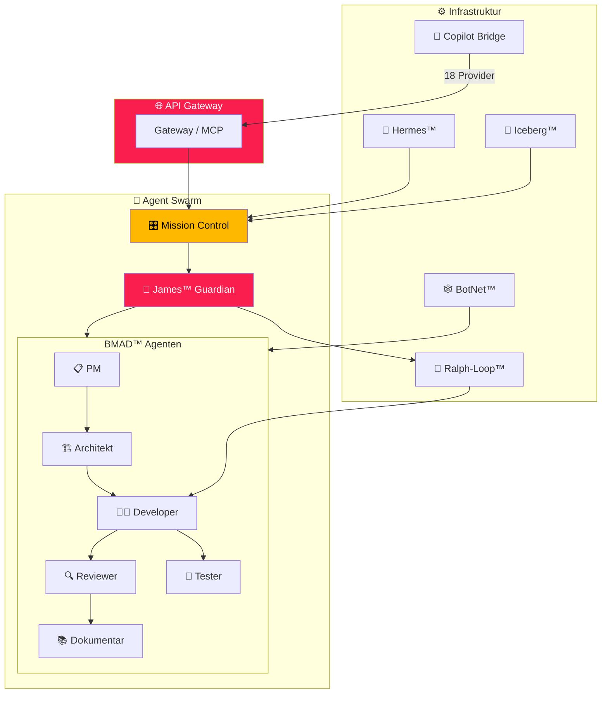

# 📐 Architektur

## System-Übersicht

## Datenfluss

1. **Request** → API Gateway → Mission Control
2. **Routing** → James™ analysiert Task → delegiert an Agent
3. **Execution** → Ralph-Loop™ (6 Phasen)
4. **Persistenz** → Iceberg™ (Dreifach-Verankerung)
5. **Kommunikation** → Hermes™ (Matrix + NanoChat)
