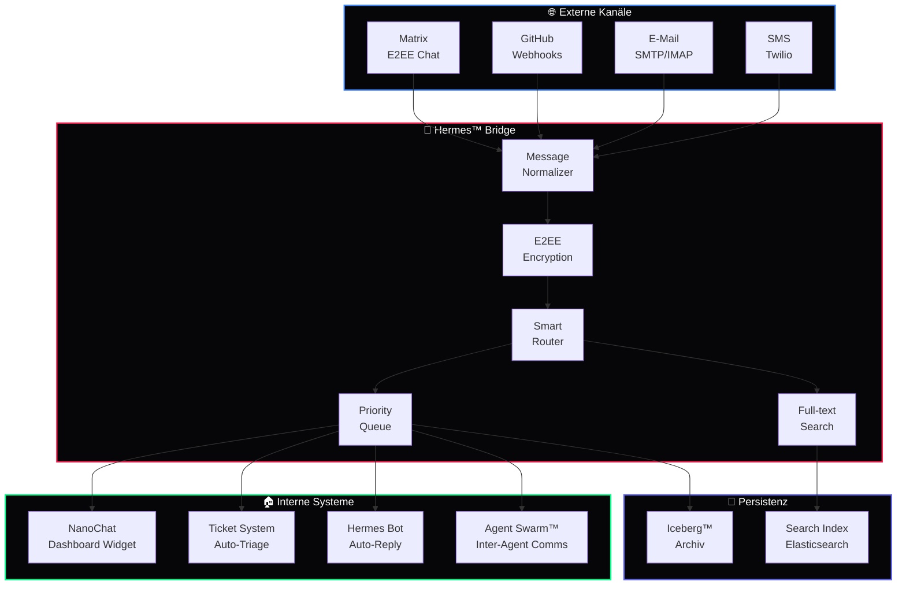

<div align="center">

# 📨 Hermes™

### Unified Communication Layer für DEVKiTZ™

[](https://github.com/777/devkitz-ecosystem)
[](https://github.com/777/devkitz-ecosystem)
[](https://github.com/777/devkitz-ecosystem)
[](https://github.com/777/devkitz-ecosystem)
[](https://github.com/777/devkitz-ecosystem)
[](https://github.com/777/devkitz-ecosystem)
[](https://github.com/777/devkitz-ecosystem)
[](https://github.com/777/devkitz-ecosystem)
[](https://github.com/777/devkitz-ecosystem)
[](https://github.com/777/devkitz-ecosystem)
[](https://github.com/777/devkitz-ecosystem)
[](https://github.com/777/devkitz-ecosystem)
[](https://github.com/777/devkitz-ecosystem)
[](https://github.com/777/devkitz-ecosystem)
[](https://github.com/777/devkitz-ecosystem)
[](https://github.com/777/devkitz-ecosystem)

**Hermes™** ist die Kommunikations-Zentrale des DEVKiTZ™ Ökosystems. Als bidirektionale Bridge verbindet sie Matrix-Chat, NanoChat, GitHub Webhooks, E-Mail und das interne Ticket-System zu einer einheitlichen Nachrichtenplattform. Alle Konversationen werden End-to-End-verschlüsselt und im Iceberg™-Archiv persistiert.

[Architektur](#-kommunikations-architektur) · [Matrix](#-matrix-bridge) · [NanoChat](#-nanochat-integration) · [Tickets](#-ticket-system) · [Notifications](#-benachrichtigungen) · [Config](#%EF%B8%8F-konfiguration)

</div>

---

## 🏗️ Kommunikations-Architektur

Hermes™ fungiert als zentrale Message-Bridge. Nachrichten von beliebigen Quellen werden normalisiert, geroutet und an die richtigen Empfänger zugestellt — inklusive Agent-zu-Agent-Kommunikation im Swarm.



---

## 🔐 Matrix Bridge

Die Matrix-Bridge ist das primäre Kommunikationsprotokoll. Jeder DEVKiTZ™ Raum wird automatisch erstellt und verwaltet. End-to-End-Verschlüsselung ist standardmäßig aktiv.

| Raum | Zweck | Mitglieder | Auto-Join |
|:-----|:------|:-----------|:----------|
| `#devkitz-general` | Allgemeine Kommunikation | Alle | ✅ |
| `#devkitz-alerts` | System-Alerts & Ampel | James™, 777 | ✅ |
| `#devkitz-commits` | Git-Aktivität | Developer™, Reviewer™ | ✅ |
| `#devkitz-tickets` | Ticket-Updates | PM™, 777 | ✅ |
| `#devkitz-swarm` | Agent-Koordination | Alle Agenten | ✅ |
| `#devkitz-debug` | Debug-Logs (verbose) | Developer™ | ❌ |

```javascript
// Matrix Bridge Verbindung
const matrixBridge = {
  homeserver: 'https://matrix.devkitz.com',
  botUser: '@hermes:devkitz.com',
  
  async sendToRoom(roomAlias, message, options = {}) {
    const room = await this.resolveRoom(roomAlias);
    
    // E2EE Verschlüsselung
    const encrypted = options.e2ee !== false 
      ? await this.encrypt(message, room.sessionKey)
      : message;
    
    return this.client.sendMessage(room.id, {
      msgtype: options.type || 'm.text',
      body: encrypted,
      format: 'org.matrix.custom.html',
      formatted_body: this.renderMarkdown(message)
    });
  },
  
  // GitHub Webhook → Matrix
  async bridgeGitHubEvent(event) {
    const formatted = this.formatGitHub(event);
    await this.sendToRoom('#devkitz-commits', formatted, {
      type: 'm.notice'
    });
  }
};
```

---

## 💬 NanoChat Integration

NanoChat ist das in das DEVKiTZ™ Dashboard eingebettete Chat-Widget. Es kommuniziert bidirektional mit Matrix und bietet schnellen Zugriff auf den Copilot Bridge™ für KI-Antworten.

```javascript
// NanoChat Widget — Dashboard-seitig
class NanoChat {
  constructor() {
    this.ws = new WebSocket('wss://hermes.devkitz.com/nanochat');
    this.history = [];
  }

  async send(message) {
    // Nachricht an Hermes Bridge senden
    this.ws.send(JSON.stringify({
      type: 'chat',
      from: 'user:777',
      channel: 'nanochat',
      body: message,
      timestamp: Date.now()
    }));
    
    // KI-Antwort über Copilot Bridge anfordern
    if (message.startsWith('/ask ')) {
      const response = await fetch('/api/copilot/complete', {
        method: 'POST',
        body: JSON.stringify({ prompt: message.slice(5) })
      });
      this.displayResponse(await response.json());
    }
  }
}
```

| Feature | Beschreibung | Status |
|:--------|:-------------|:-------|
| Echtzeit-Chat | WebSocket-basiert, < 50ms Latenz | ✅ Aktiv |
| KI-Antworten | `/ask` Command für Copilot Bridge™ | ✅ Aktiv |
| Markdown | Volle GFM-Unterstützung im Chat | ✅ Aktiv |
| Code-Blöcke | Syntax-Highlighting im Widget | ✅ Aktiv |
| Datei-Upload | Drag & Drop Anhänge | ✅ Aktiv |
| Matrix-Bridge | Bidirektional mit Matrix-Räumen | ✅ Aktiv |
| Voice Messages | Sprach-Nachrichten aufnehmen | 🔮 Geplant |

---

## 🎫 Ticket-System

Hermes™ integriert ein automatisches Ticket-System. GitHub Issues, Fehler-Alerts und manuelle Requests werden als Tickets erfasst, priorisiert und dem richtigen Agenten zugewiesen.

| Feld | Typ | Beschreibung |
|:-----|:----|:-------------|
| `id` | String | `TKT-YYYY-MMDD-NNN` |
| `title` | String | Kurzbeschreibung |
| `source` | Enum | `github`, `matrix`, `email`, `manual`, `agent` |
| `priority` | Enum | `P0` (Kritisch) bis `P3` (Nice-to-have) |
| `assignee` | String | Zugewiesener Agent oder User |
| `status` | Enum | `open`, `in-progress`, `review`, `closed` |
| `tags` | Array | Modul, Feature, Kategorie |
| `thread` | Array | Konversations-Verlauf |

```javascript
// Auto-Triage: Ticket wird automatisch klassifiziert
async function triageTicket(ticket) {
  // Priorität basierend auf Keywords
  const p0Keywords = ['crash', 'down', 'critical', 'security', 'data-loss'];
  const p1Keywords = ['bug', 'broken', 'error', 'regression'];
  
  if (p0Keywords.some(k => ticket.title.toLowerCase().includes(k))) {
    ticket.priority = 'P0';
    ticket.assignee = 'James™';
    await hermes.sendToRoom('#devkitz-alerts', `🔴 P0 Ticket: ${ticket.title}`);
  }
  
  // Agent-Zuweisung basierend auf Tags
  const agentMap = {
    'code': 'DkZ Developer™',
    'review': 'DkZ Reviewer™',
    'test': 'DkZ Tester™',
    'docs': 'DkZ Dokumentar™',
    'spec': 'DkZ PM™'
  };
  
  ticket.assignee = ticket.assignee || agentMap[ticket.tags[0]] || 'DkZ PM™';
  return ticket;
}
```

---

## 🔔 Benachrichtigungen

Hermes™ unterstützt Multi-Channel-Benachrichtigungen. Jeder Alert wird basierend auf Priorität und Empfänger-Präferenzen über den passenden Kanal zugestellt.

| Priorität | Matrix | NanoChat | E-Mail | SMS | Push |
|:----------|:-------|:---------|:-------|:----|:-----|
| **P0** Kritisch | ✅ | ✅ | ✅ | ✅ | ✅ |
| **P1** Hoch | ✅ | ✅ | ✅ | ❌ | ✅ |
| **P2** Normal | ✅ | ✅ | ❌ | ❌ | ❌ |
| **P3** Niedrig | ✅ | ❌ | ❌ | ❌ | ❌ |

---

## 📡 API-Referenz

| Endpoint | Methode | Beschreibung |
|:---------|:--------|:-------------|
| `/api/hermes/send` | `POST` | Nachricht an Kanal senden |
| `/api/hermes/rooms` | `GET` | Alle Matrix-Räume auflisten |
| `/api/hermes/tickets` | `GET` | Offene Tickets abfragen |
| `/api/hermes/tickets` | `POST` | Neues Ticket erstellen |
| `/api/hermes/search` | `GET` | Volltext-Suche über Nachrichten |
| `/api/hermes/history/:room` | `GET` | Chatverlauf eines Raums |
| `/ws/nanochat` | `WS` | NanoChat WebSocket-Verbindung |

---

## ⚙️ Konfiguration

```json
{
  "hermes": {
    "matrix": {
      "homeserver": "https://matrix.devkitz.com",
      "botUser": "@hermes:devkitz.com",
      "e2ee": true,
      "autoJoin": true
    },
    "nanochat": {
      "wsPort": 3200,
      "maxHistory": 1000,
      "markdownEnabled": true
    },
    "tickets": {
      "autoTriage": true,
      "defaultAssignee": "DkZ PM™",
      "p0Alert": ["matrix", "email", "sms"]
    },
    "email": {
      "smtp": { "host": "smtp.devkitz.com", "port": 587, "tls": true },
      "imap": { "host": "imap.devkitz.com", "port": 993, "tls": true }
    },
    "archive": {
      "backend": "iceberg",
      "retentionDays": -1,
      "searchIndex": "elasticsearch"
    }
  }
}
```

---

## 🔗 Verwandte Systeme

| System | Kommunikation | Link |
|:-------|:-------------|:-----|
| 🐝 Agent Swarm™ | Inter-Agent Messaging via Hermes | [agent-swarm/](../agent-swarm/) |
| 🔄 Ralph-Loop™ | Fehler-Notifications bei Phase-Failures | [ralph-loop/](../ralph-loop/) |
| 🕸️ BotNet™ | Deployment-Alerts und Status-Updates | [botnet-ops/](../botnet-ops/) |
| 🤖 Copilot Bridge™ | NanoChat → KI-Antworten via Bridge | [copilot-bridge/](../copilot-bridge/) |
| 🧊 Iceberg™ | Alle Nachrichten werden archiviert | [iceberg-data/](../iceberg-data/) |

---

<div align="center">

**📨 Hermes™** — Teil des [DEVKiTZ™ Ökosystems](https://github.com/777/devkitz-ecosystem)

`Built with 🔥 by 777 · Matrix E2EE · NanoChat · Zero Message Lost`

[](https://github.com/777/devkitz-ecosystem)

</div>
