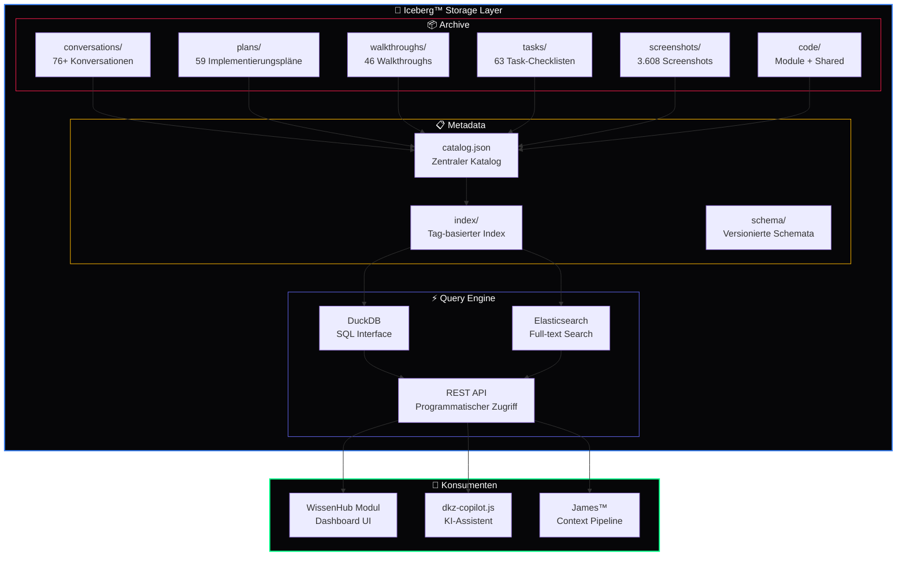

<div align="center">

# 🧊 Iceberg™

### Immutable Data Persistence & Triple-Anchor Archiv

[](https://github.com/777/devkitz-ecosystem)
[](https://github.com/777/devkitz-ecosystem)
[](https://github.com/777/devkitz-ecosystem)
[](https://github.com/777/devkitz-ecosystem)
[](https://github.com/777/devkitz-ecosystem)
[](https://github.com/777/devkitz-ecosystem)
[](https://github.com/777/devkitz-ecosystem)
[](https://github.com/777/devkitz-ecosystem)
[](https://github.com/777/devkitz-ecosystem)
[](https://github.com/777/devkitz-ecosystem)
[](https://github.com/777/devkitz-ecosystem)
[](https://github.com/777/devkitz-ecosystem)
[](https://github.com/777/devkitz-ecosystem)
[](https://github.com/777/devkitz-ecosystem)
[](https://github.com/777/devkitz-ecosystem)
[](https://github.com/777/devkitz-ecosystem)

**Iceberg™** ist das Daten-Rückgrat des DEVKiTZ™ Ökosystems. Jedes Artefakt — ob Code, Konversation, Screenshot oder Konfiguration — wird **immutable** archiviert, dreifach verankert und über SQL abfragbar. Basierend auf Apache Iceberg und DuckDB als Query-Engine bietet es Enterprise-grade Persistenz für das gesamte Entwicklerwissen.

[Schema](#-archiv-schema) · [Dreifach-Anker](#-dreifach-verankerung) · [Catalog](#-catalog-spezifikation) · [Queries](#-query-beispiele) · [API](#-api-referenz) · [Config](#%EF%B8%8F-konfiguration)

</div>

---

## 🏗️ Archiv-Schema

Iceberg™ organisiert alle Daten in einem hierarchischen Schema mit Date-Partitioning und Tag-basiertem Indexing. Jedes Artefakt erhält einen JSON-Sidecar mit vollständigen Metadaten.



---

## ⚓ Dreifach-Verankerung

Jedes Artefakt im DEVKiTZ™ Ökosystem wird **dreifach verankert** — das garantiert, dass kein Wissen verloren geht, selbst bei Ausfall einzelner Systeme.

| Anker | System | Funktion | Zugriff |
|:------|:-------|:---------|:--------|
| 🧊 **Anker 1** | Iceberg™ Archiv | Immutable Storage + JSON Sidecar | SQL via DuckDB |
| 📊 **Anker 2** | WissenHub Modul | Suchbar im Dashboard, Filter nach Tags/Typ/Datum | Browser UI |
| 🤖 **Anker 3** | dkz-copilot.js | KI-Zugriff: „Wie geht X?", „Wo ist Y?" | Chat-Interface |

```javascript
// Dreifach-Verankerung eines neuen Artefakts
async function tripleAnchor(artifact) {
  const metadata = {
    id: `ART-${formatDate()}-${nextSequence()}`,
    type: artifact.type,        // walkthrough | task | impl-plan | ...
    tags: artifact.tags,
    title: artifact.title,
    conversation: artifact.conversationId,
    date: new Date().toISOString().split('T')[0],
    module: artifact.module,
    status: artifact.status || 'complete',
    summary: artifact.summary
  };

  // Anker 1: Iceberg™ Archiv
  const archivePath = `archive/${artifact.type}/${metadata.id}/`;
  await iceberg.write(archivePath, artifact.content);
  await iceberg.write(`${archivePath}metadata.json`, metadata);
  await catalog.addEntry(metadata);

  // Anker 2: WissenHub Modul
  await wissenHub.index({
    ...metadata,
    searchText: extractSearchableText(artifact.content),
    thumbnail: artifact.screenshot || null
  });

  // Anker 3: Copilot Knowledge Base
  await copilot.ingest({
    id: metadata.id,
    content: artifact.content,
    metadata: metadata,
    embeddings: await generateEmbeddings(artifact.content)
  });

  return metadata;
}
```

---

## 📑 Catalog-Spezifikation

Der `catalog.json` ist die Single Source of Truth für alle archivierten Artefakte. Er wird bei jeder Dreifach-Verankerung automatisch aktualisiert.

```json
{
  "catalog": {
    "version": "2.4.0",
    "lastUpdated": "2026-05-28T16:00:00Z",
    "stats": {
      "conversations": 76,
      "plans": 59,
      "walkthroughs": 46,
      "tasks": 63,
      "screenshots": 3608,
      "totalFiles": 7708
    },
    "entries": [
      {
        "id": "ART-2026-0528-001",
        "type": "walkthrough",
        "tags": ["swarm", "readme", "docs"],
        "title": "Swarm README Premium Dokumentation",
        "conversation": "e6de17c2-bf0c-47ce-b07a-462292705703",
        "date": "2026-05-28",
        "module": "temp_swarm",
        "status": "complete",
        "summary": "6 Premium README-Dateien für alle Swarm-Subsysteme",
        "path": "archive/walkthrough/ART-2026-0528-001/",
        "sizeBytes": 45200,
        "checksum": "sha256:a1b2c3d4..."
      }
    ]
  }
}
```

### Artefakt-Typen

| Typ | Tag | Beschreibung | Anzahl |
|:----|:----|:-------------|:-------|
| 📋 Task | `task` | Checkliste, Fortschritt, Sub-Items | 63 |
| 📖 Walkthrough | `walkthrough` | Nachweis, Screenshots, Ergebnisse | 46 |
| 📐 Implementierungsplan | `impl-plan` | Technischer Plan, Proposed Changes | 59 |
| 🏗️ Blaupause | `blueprint` | Architektur, Modul-Design | — |
| 📝 Scratchpad | `scratch` | Notizen, Ideen, Research | — |
| 🔬 Research | `research` | Recherche, Analyse, Vergleiche | — |
| 📊 Report | `report` | Status-Berichte, Metriken | — |

---

## 🔍 Query-Beispiele

Iceberg™ stellt eine DuckDB-basierte SQL-Schnittstelle bereit. Alle Artefakte sind über Standard-SQL abfragbar — inklusive JSON-Felder und Array-Operationen.

```sql
-- Alle Walkthroughs eines bestimmten Moduls finden
SELECT id, title, date, status
FROM iceberg.catalog
WHERE type = 'walkthrough'
  AND module = 'temp_swarm'
ORDER BY date DESC;

-- Artefakte mit bestimmten Tags suchen
SELECT id, title, tags, summary
FROM iceberg.catalog
WHERE tags @> ARRAY['swarm', 'docs']
  AND status = 'complete';

-- Statistiken pro Modul
SELECT 
  module,
  COUNT(*) as total_artifacts,
  COUNT(CASE WHEN type = 'task' THEN 1 END) as tasks,
  COUNT(CASE WHEN type = 'walkthrough' THEN 1 END) as walkthroughs,
  COUNT(CASE WHEN status = 'complete' THEN 1 END) as completed
FROM iceberg.catalog
GROUP BY module
ORDER BY total_artifacts DESC;

-- Conversations der letzten 7 Tage
SELECT id, title, date, 
       json_extract(metadata, '$.summary') as summary
FROM iceberg.catalog
WHERE type = 'conversation'
  AND date >= CURRENT_DATE - INTERVAL '7 days'
ORDER BY date DESC
LIMIT 20;

-- Volltext-Suche über alle Artefakte
SELECT id, title, module,
       fts_search(content, 'Ralph-Loop Fehlerbehandlung') as relevance
FROM iceberg.catalog
WHERE fts_search(content, 'Ralph-Loop Fehlerbehandlung') > 0.5
ORDER BY relevance DESC
LIMIT 10;
```

---

## 📡 API-Referenz

| Endpoint | Methode | Beschreibung |
|:---------|:--------|:-------------|
| `/api/iceberg/catalog` | `GET` | Gesamten Katalog abfragen |
| `/api/iceberg/artifact/:id` | `GET` | Einzelnes Artefakt laden |
| `/api/iceberg/artifact` | `POST` | Neues Artefakt mit Triple-Anchor speichern |
| `/api/iceberg/search` | `GET` | Volltext-Suche über alle Artefakte |
| `/api/iceberg/query` | `POST` | Freie SQL-Query gegen DuckDB |
| `/api/iceberg/stats` | `GET` | Aktuelle Bestandsstatistiken |
| `/api/iceberg/tags` | `GET` | Alle verfügbaren Tags auflisten |
| `/api/iceberg/backup/trigger` | `POST` | Manuelles Backup auslösen |

---

## 💾 Storage-Layout

```
modules/wissen-hub/archive/
├── conversations/          # 76+ Konversationen
│   ├── CONV-2026-0101-001/
│   │   ├── content.md
│   │   └── metadata.json
│   └── ...
├── plans/                  # 59 Implementierungspläne
│   ├── PLAN-2026-0215-001/
│   │   ├── plan.md
│   │   ├── proposed-changes.diff
│   │   └── metadata.json
│   └── ...
├── walkthroughs/           # 46 Walkthroughs
├── tasks/                  # 63 Task-Checklisten
├── screenshots/            # 3.608 Screenshots
├── catalog.json            # Zentraler Katalog
├── index/                  # Tag-basierter Index
│   ├── by-module.json
│   ├── by-type.json
│   ├── by-date.json
│   └── by-tag.json
└── schema/                 # Versionierte Schemata
    ├── v1.0.json
    ├── v2.0.json
    └── v2.4.json
```

---

## ⚙️ Konfiguration

```json
{
  "iceberg": {
    "storage": {
      "local": "modules/wissen-hub/archive/",
      "cloud": "s3://devkitz-iceberg/",
      "syncMode": "bidirectional"
    },
    "duckdb": {
      "path": "data/iceberg.duckdb",
      "readOnly": false,
      "threads": 4,
      "memoryLimit": "2GB"
    },
    "compression": "snappy",
    "partitioning": { "key": "date", "granularity": "month" },
    "retention": { "policy": "forever", "immutable": true },
    "backup": {
      "strategy": "triple",
      "schedule": "0 */6 * * *",
      "destinations": ["local", "s3", "b2"]
    },
    "search": {
      "engine": "elasticsearch",
      "indexOnWrite": true,
      "language": "german"
    }
  }
}
```

---

## 🔗 Verwandte Systeme

| System | Datenfluss | Link |
|:-------|:----------|:-----|
| 🐝 Agent Swarm™ | Event-Logs werden archiviert | [agent-swarm/](../agent-swarm/) |
| 🔄 Ralph-Loop™ | Phase 5 COMMIT → Dreifach-Verankerung | [ralph-loop/](../ralph-loop/) |
| 🕸️ BotNet™ | Backup-Daten werden gespeichert | [botnet-ops/](../botnet-ops/) |
| 🤖 Copilot Bridge™ | Response-Cache persistiert | [copilot-bridge/](../copilot-bridge/) |
| 📨 Hermes™ | Chat-Historie wird archiviert | [hermes-comms/](../hermes-comms/) |

---

<div align="center">

**🧊 Iceberg™** — Teil des [DEVKiTZ™ Ökosystems](https://github.com/777/devkitz-ecosystem)

`Built with 🔥 by 777 · Immutable · Triple-Anchored · Forever Retention`

[](https://github.com/777/devkitz-ecosystem)

</div>
