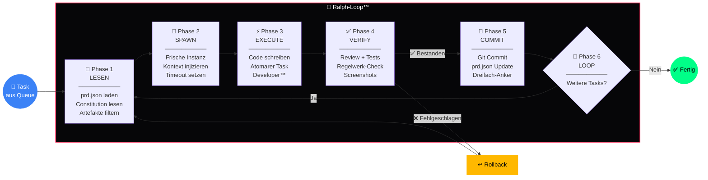

<div align="center">

# 🔄 Ralph-Loop™

### 6-Phasen Execution Pipeline — Frischer Kontext für jeden Task

[](https://github.com/777/devkitz-ecosystem)
[](https://github.com/777/devkitz-ecosystem)
[](https://github.com/777/devkitz-ecosystem)
[](https://github.com/777/devkitz-ecosystem)
[](https://github.com/777/devkitz-ecosystem)
[](https://github.com/777/devkitz-ecosystem)
[](https://github.com/777/devkitz-ecosystem)
[](https://github.com/777/devkitz-ecosystem)
[](https://github.com/777/devkitz-ecosystem)
[](https://github.com/777/devkitz-ecosystem)
[](https://github.com/777/devkitz-ecosystem)
[](https://github.com/777/devkitz-ecosystem)
[](https://github.com/777/devkitz-ecosystem)
[](https://github.com/777/devkitz-ecosystem)
[](https://github.com/777/devkitz-ecosystem)
[](https://github.com/777/devkitz-ecosystem)

**Ralph-Loop™** ist das Herzstück der DEVKiTZ™ Task-Execution. Jeder Task durchläuft exakt 6 Phasen — von der Kontextanalyse bis zum Git-Commit. Das Kernprinzip: **Jeder Task bekommt einen frischen Kontext**, sodass kein Context-Drift die Qualität beeinträchtigt.

[Phasen](#-die-6-phasen) · [Flowchart](#-pipeline-flowchart) · [Context-Drift](#-context-drift-prevention) · [Fehler](#-fehlerbehandlung) · [Config](#%EF%B8%8F-konfiguration)

</div>

---

## 🔁 Die 6 Phasen

Jede Phase hat einen klar definierten Eingang, eine Verantwortung und einen Ausgang. Scheitert eine Phase, greift das automatische Rollback — der gesamte Loop wird sauber zurückgesetzt.

### Phase 1 — 📖 LESEN

Der Einstiegspunkt jedes Loops. James™ analysiert die Task-Tags und lädt **nur relevante** Artefakte aus dem Iceberg™-Archiv. Irrelevanter Kontext wird bewusst ausgelassen.

```javascript
// Phase 1: Kontextanalyse durch James™
async function phaseLesen(task) {
  const prd = await loadJSON('prd.json');
  const constitution = await loadFile('CLAUDE.md');
  const agents = await loadFile('AGENTS.md');
  
  // Nur relevante Artefakte laden
  const artifacts = await iceberg.query({
    tags: task.tags,
    module: task.module,
    limit: 5  // Maximal 5 Kontext-Artefakte
  });
  
  return { prd, constitution, agents, artifacts };
}
```

### Phase 2 — 🚀 SPAWN

Eine **neue Agent-Instanz** wird mit frischem Kontext gestartet. Kein alter State, keine veralteten Annahmen. Der Agent erhält exakt die Informationen aus Phase 1.

### Phase 3 — ⚡ EXECUTE

Der Developer™ schreibt Code. Jeder Task ist **atomar** — ein Feature, ein Bug-Fix, eine Verbesserung. Niemals mehrere Dinge gleichzeitig in einem Loop.

### Phase 4 — ✅ VERIFY

Reviewer™ und Tester™ prüfen das Ergebnis. Code-Qualität, Regelwerk-Konformität, Screenshots und E2E-Tests werden automatisch durchgeführt.

### Phase 5 — 📝 COMMIT

Bei bestandener Verifikation wird ein Git-Commit erstellt und die `prd.json` mit dem neuen Task-Status aktualisiert. Das Artefakt wird dreifach verankert.

### Phase 6 — 🔄 LOOP

Der Loop prüft, ob weitere Tasks in der Queue stehen. Falls ja, wird Phase 1 mit dem **nächsten Task** gestartet — mit komplett frischem Kontext.

---

## 📊 Pipeline-Flowchart



---

## 🛡️ Context-Drift Prevention

Context-Drift ist der größte Feind langlebiger Agent-Sessions. Ralph-Loop™ eliminiert dieses Problem durch konsequente Isolation.

| Problem | Lösung | Mechanismus |
|:--------|:-------|:------------|
| Veraltete Annahmen | Frischer Kontext pro Task | Phase 2: SPAWN erzeugt neue Instanz |
| Kontext-Überladung | Selektives Laden | James™ filtert nach Task-Tags |
| Halluzination durch alten State | Kein State-Carry-Over | Jeder Loop startet bei Null |
| Widersprüchliche Instruktionen | Constitution First | `CLAUDE.md` + `AGENTS.md` immer geladen |
| Schleichende Qualitätsabnahme | Atomare Tasks | Ein Task = Ein Loop = Ein Commit |

```javascript
// Context-Drift Guard — verhindert veralteten Kontext
function validateContextFreshness(context) {
  const maxAge = 30 * 60 * 1000; // 30 Minuten
  
  if (Date.now() - context.loadedAt > maxAge) {
    throw new ContextDriftError(
      'Kontext älter als 30min — SPAWN wird erzwungen'
    );
  }
  
  // Prüfe ob Constitution aktuell ist
  const currentHash = hashFile('CLAUDE.md');
  if (context.constitutionHash !== currentHash) {
    throw new ContextDriftError(
      'Constitution hat sich geändert — Reload erforderlich'
    );
  }
}
```

---

## 🚨 Fehlerbehandlung pro Phase

Jede Phase hat eine spezifische Fehlerbehandlung. Das System unterscheidet zwischen **transienten** Fehlern (Retry) und **permanenten** Fehlern (Eskalation).

| Phase | Fehlertyp | Aktion | Max. Retries |
|:------|:----------|:-------|:-------------|
| LESEN | Datei nicht gefunden | Fallback auf Cache | 2 |
| LESEN | prd.json korrupt | Eskalation an James™ | 0 |
| SPAWN | Timeout beim Start | Auto-Retry mit Backoff | 3 |
| EXECUTE | Code-Fehler | Rollback + Retry | 3 |
| EXECUTE | Timeout (30min) | Task pausieren, nächsten starten | 1 |
| VERIFY | Test fehlgeschlagen | Zurück zu EXECUTE | 2 |
| VERIFY | Regelwerk-Verletzung | Sofort-Stopp, James™ Alert | 0 |
| COMMIT | Git-Konflikt | Rebase + Retry | 3 |
| COMMIT | Dreifach-Anker fehlgeschlagen | Warnung, Commit trotzdem | 1 |

---

## 📋 PRD-Format (prd.json)

Die `prd.json` ist die Single Source of Truth für alle Tasks im Loop. Sie wird nach jedem COMMIT automatisch aktualisiert.

```json
{
  "project": "devkitz-dashboard",
  "version": "2.4.0",
  "tasks": [
    {
      "id": "TASK-2026-0528-001",
      "title": "Swarm README erstellen",
      "module": "temp_swarm",
      "priority": "P1",
      "status": "completed",
      "assignee": "DkZ Dokumentar™",
      "tags": ["docs", "readme", "swarm"],
      "loop": {
        "phase": 5,
        "retries": 0,
        "startedAt": "2026-05-28T16:00:00Z",
        "completedAt": "2026-05-28T16:05:00Z"
      }
    }
  ]
}
```

---

## ⚙️ Konfiguration

```json
{
  "ralphLoop": {
    "phases": 6,
    "taskMode": "atomic",
    "contextMode": "fresh",
    "maxContextArtifacts": 5,
    "timeout": 1800000,
    "maxRetries": 3,
    "rollback": {
      "auto": true,
      "gitReset": "soft"
    },
    "constitution": ["CLAUDE.md", "AGENTS.md", "REGELWERK.md"],
    "driftGuard": {
      "enabled": true,
      "maxAge": 1800000,
      "hashCheck": true
    }
  }
}
```

---

## 🔗 Verwandte Systeme

| System | Rolle im Loop | Link |
|:-------|:-------------|:-----|
| 🐝 Agent Swarm™ | Orchestriert die Agenten | [agent-swarm/](../agent-swarm/) |
| 🧊 Iceberg™ | Artefakt-Persistenz in Phase 5 | [iceberg-data/](../iceberg-data/) |
| 🤖 Copilot Bridge™ | LLM-Provider für EXECUTE | [copilot-bridge/](../copilot-bridge/) |
| 📨 Hermes™ | Benachrichtigungen bei Fehlern | [hermes-comms/](../hermes-comms/) |
| 🕸️ BotNet™ | Deployment nach Loop | [botnet-ops/](../botnet-ops/) |

---

<div align="center">

**🔄 Ralph-Loop™** — Teil des [DEVKiTZ™ Ökosystems](https://github.com/777/devkitz-ecosystem)

`Built with 🔥 by 777 · Fresh Context · Zero Drift · Atomic Tasks`

[](https://github.com/777/devkitz-ecosystem)

</div>
